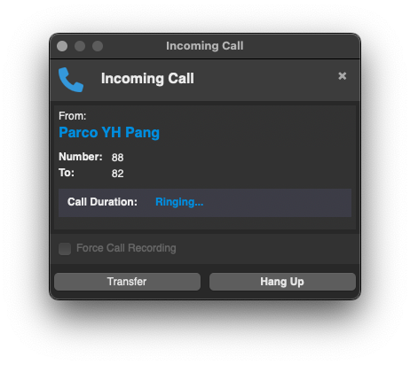

# FreePBX Popup Client for macOS


I needed my Mac to show popup for incoming calls to my extensions and is too cheap to buy a commercial solution - so this is the result. This is a macOS menu bar application that connects to your FreePBX server via AMI (Asterisk Manager Interface) and displays popups for incoming calls.



> [!IMPORTANT]
> I wrote this mainly for myself - so it's probably expectedly (but tolerably) buggy - my apologies ;)

## Features

- **Native macOS Experience**: Built with Python and wxPython for a truly native macOS experience
- **Menu Bar Integration**: Convenient menu bar app with status indicator
- **Rich Call Notifications**: Detailed call notifications with caller ID information
- **Call Management**: Hang up calls directly from the notification
- **Dark Mode Support**: Seamless integration with macOS dark mode
- **Tabbed Interface**: Organized settings in a clean, tabbed interface
- **Always-on-Top Notifications**: Call notifications stay visible until addressed
- **Auto-Dismiss**: Notifications automatically close when calls end
- **Call Recording Toggle**: Optional force call recording feature
- **Start at Login**: Option to launch automatically at system startup

## Requirements

- macOS 10.14 or later
- FreePBX server with AMI enabled

## Installation

1. Download the latest release from the [Releases](https://github.com/parcoyhpang/freepbx-popup/releases) page
2. Mount the DMG file
3. Drag the FreePBX Popup app to your Applications folder
4. Launch the app and configure your FreePBX AMI settings

## FreePBX AMI Configuration

To use this client, you need to enable and configure AMI on your FreePBX server:

1. In FreePBX, go to Settings > Asterisk Manager Users
2. Create a new AMI user or edit an existing one
3. Set a username and password
4. Set "Deny" to 0.0.0.0/0.0.0.0 and "Permit" to 0.0.0.0/0.0.0.0 (or restrict to specific IPs)
5. Enable "Read" and "Write" permissions
6. Save the changes and apply the configuration

## Building from Source

### Prerequisites

- Python 3.8 or later
- pip
- macOS development tools

### Build Steps

1. Clone the repository:
   ```bash
   git clone https://github.com/parcoyhpang/freepbx-popup.git
   cd freepbx-popup
   ```

2. Install dependencies:
   ```bash
   pip3 install -r requirements.txt
   ```

3. Run the build script:
   ```bash
   ./build.sh
   ```

4. The built application will be available in the `dist` folder

## Usage

Once the application is running, you will see a phone icon in your menu bar. Click on it to access the following options:

- **Preferences**: Configure the application settings
- **About**: View information about the application
- **Quit**: Exit the application

### Preferences

The Preferences window has several tabs for configuration:

- **Connection**: Configure your FreePBX server connection settings
- **Notifications**: Customize notification appearance and behavior
- **General**: Set startup options and other preferences

### Notifications

When you receive a call, a notification window will appear with:

- Caller name and number
- Call duration
- Hang up button

The notification will automatically dismiss when the call ends or is answered.

## Contributing

Contributions are welcome! Please feel free to submit a Pull Request.

1. Fork the repository
2. Create your feature branch (`git checkout -b feature/amazing-feature`)
3. Commit your changes (`git commit -m 'Add some amazing feature'`)
4. Push to the branch (`git push origin feature/amazing-feature`)
5. Open a Pull Request

## License

This project is licensed under the MIT License - see the [LICENSE](LICENSE) file for details.

## Acknowledgments

- [wxPython](https://www.wxpython.org/) for the native UI components
- [rumps](https://github.com/jaredks/rumps) for the menu bar integration
- [PyInstaller](https://www.pyinstaller.org/) for application packaging
- [FreePBX](https://www.freepbx.org/) for the amazing PBX platform

## Roadmap

Future plans for the FreePBX Popup Client include:

- **Call Transfer**: Ability to transfer calls directly from the notification window
- **Call History**: View and manage your call history
- **Contact Integration**: Integration with macOS Contacts
- **Multiple Server Support**: Connect to multiple FreePBX servers simultaneously
- **Customizable Notification Templates**: Create your own notification layouts
- **Localization**: Support for multiple languages
- **Analytics**: Basic call statistics and reporting

## Bug Reports and Issues

If you encounter any bugs or issues with the FreePBX Popup Client, please report them on the [GitHub Issues page](https://github.com/parcoyhpang/FreePBX-PopUp-macOS/issues). When reporting an issue, please include:

- A clear and descriptive title
- Steps to reproduce the issue
- Expected behavior
- Actual behavior
- Screenshots (if applicable)
- Your macOS version
- Your FreePBX version

This helps us identify and fix issues more quickly.

## Author

- **Parco Y.H. Pang** - [parcoyhpang](https://github.com/parcoyhpang) - [parcopang.com](https://parcopang.com)

---

Made with ❤️ for the FreePBX community
